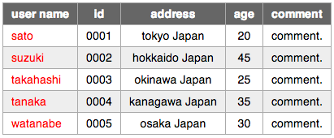

Japanese  / English(under construction)


Features
-----

dscltable.jsは、モバイルサイトやPCサイトに限定せず軽量で容易に扱える
以下の機能を持つjqueryテーブルです。


*   列の行表示切替（横幅の制限されるスマートフォンでの利用を想定）
*   ajaxによるサーバ連携
*   簡易ページャ
*   行選択


Sample View
-----
ajaxによるサーバ取得、簡易ページャ、行選択の例です。
PCで見ると通常の一覧、スマートフォンで見ると列を行表示に切り替えた表になります。
（サーバが出力するデータは静的なもので、ページャやソートは動作しません^^;）

<script type="text/javascript">
		$(function(){
			var ua = navigator.userAgent.toLowerCase();
			var isSP = (ua.indexOf('iphone') > -1 || (ua.indexOf('android') > -1 && ua.indexOf('mobile') > -1));
		    $('#sampleview').dscltable({
		    	method: 'GET',
		        url: 'sampleview.json',
		        selectable : true,
				selectableRadio : true,
				selectableRadioTH : "",
				tableLoadingImage : 'stylesheets/indicator.gif',
		        tableClass : 'table',
		        pager: true,
       	        pagerLoadingImage : 'stylesheets/indicator.gif',
		        pagerClass : 'pager',
		        pagerPrevClass : "enabled",
		        pagerNextClass : "enabled",
		        pagerPrevDisableClass : "disabled",
		        pagerNextDisableClass : "disabled",
		        vertical : isSP,
		        verticalStart : 2,
				verticalLength : 4,
				verticalTH : "contents",
		        onReady : function(){
				    $('#sampleview').dscltableLoad();
		        },
		        model : [
		            {display: 'user name', tdClass:'user' },
		            {display: 'id', tdClass:'data' },
		            {display: 'address',    tdClass:'data' },
		            {display: 'age',    tdClass:'data' },
		            {display: 'comment',    tdClass:'data' }
		        ]
		    });
		});
</script>
<div id="sampleview"></div>


Change Log
-----

*  v1.0 2013.1
    *  first public version.

Required
-----

*  IE9, FF, Chrome, Safari(iPhone)
*  jquery-1.8.x（確認したverを記載）

※jqueryベースのため、大抵のブラウザで稼働します。

Quick Start
-----

ここでは一番シンプルなテーブルを表示してみます。
事前に[ダウンロード](https://github.com/dosancole/dscltable/zipball/master "ダウンロード")したファイルを展開、配置しておいてください。
参照可能な位置にhtmlファイルとJSONのデータファイルを作成します。


まずは以下のhtmlファイルを用意してください。
※cssとjavascriptのURL、後で用意するdata.jsonのURLは、配置場所によって修正してください。

	<!DOCTYPE html PUBLIC "-//W3C//DTD XHTML 1.0 Transitional//EN" "http://www.w3.org/TR/xhtml1/DTD/xhtml1-transitional.dtd">
	<html>
	<head>
		<meta http-equiv="Content-Type" content="text/html; charset=UTF-8" />
		<script type="text/javascript" src="js/jquery-1.8.1.min.js"></script>
		<script type="text/javascript" src="js/dscltable.js" ></script>
		<script type="text/javascript">
			$(function(){
			    $('#table').dscltable({
			        url: 'data.json',
			        tableClass : 'borderd',
			        onReady : function(){
					    $('#table').dscltableLoad();
			        },
			        model : [
			            {display: 'user name', tdClass:'user' },
			            {display: 'id',        tdClass:'data' },
			            {display: 'address',   tdClass:'data' },
			            {display: 'age',       tdClass:'data' },
			            {display: 'comment',   tdClass:'data' }
			        ]
			    });
			});
		</script>
		<style type="text/css">
			body { font: 14px Helvetica,arial,freesans,clean,sans-serif !important; }
			table.borderd { border: 1px solid #aaa;border-spacing: 0px 0px !important;border-collapse: collapse !important;}
			table.borderd th { border: 1px solid #aaa; padding: 5px 10px 5px 10px;}
			table.borderd td { border: 1px solid #aaa; padding: 5px 10px 5px 10px;}
			th { color: #fff; background-color: #666;}
			td.user { text-align: left; color: red; }
			td.data { text-align: center; }
			tr.even { background-color: #eee; }
		</style>
	</head>
	<body>
		<div id="table"></div>
	</body>
	</html>

次にサーバ相当のJSONを返却する data.json を用意します（簡単のために固定のものです）。

	{
		"offset" : 0,
		"page"   : 1,
		"rows"   : [
			{ "cell" : ["sato",     "0001","tokyo Japan",    "20", "comment."] },
			{ "cell" : ["suzuki",   "0002","hokkaido Japan", "45", "comment."] },
			{ "cell" : ["takahashi","0003","okinawa Japan",  "25", "comment."] },
			{ "cell" : ["tanaka",   "0004","kanagawa Japan", "35", "comment."] },
			{ "cell" : ["watanabe", "0005","osaka Japan",    "30", "comment."] },
		],
		"total"  : 2
	}

以下が表示できます。
※ローカル環境のchromeで確認する場合、```--allow-file-access-from-files```オプションで起動する必要があります。



Construct Option
-----

Quick Startで説明したように、用意したdivに以下を呼ぶことでdscltableを構築することができます。

	$('#table').dscltable({
		url: 'data.json',
		model : [
			{display: 'user name', tdClass:'user' },
			{display: 'address',   tdClass:'address' },
			{display: 'comment',   tdClass:'comment' }
		]
	});

必須となる url と model 以外にも様々なパラメタやハンドラ関数を与えることができます。
以下にパラメタとその初期値、説明を示します。

|パラメタ|初期値|説明|
|---|---|---|
|url|(必須)|サーバ接続先。|
|model|(必須)|扱うモデルを指定。display(列名)、tdClass(データセルに与えられるCSSクラス)を持つmapの配列。|
|method|"POST"|urlで指定したURLへのHTTPメソッド。|
|tableClass|""|表のtable要素に与えるCSSクラス。|
|tableLoadingImage|(未使用)|テーブルのロード時に表の左上に表示する画像ファイル。|
|pager|false|ページャを使うかどうか。|
|rp|10|ページングする行数。|
|pagerPrevText|"prev"|ページャの前リンクの表示名。|
|pagerNextText|"next"|ページャの次リンクの表示名。|
|pagerClass|""|ページャのtable要素に与えるCSSクラス。|
|pagerPrevClass|""|ページャの前リンク活性時に与えるCSSクラス。|
|pagerNextClass|""|ページャの次リンク活性時に与えるCSSクラス。|
|pagerPrevDisableClass|""|ページャの次リンク非活性時に与えるCSSクラス。|
|pagerNextDisableClass|""|ページャの次リンク非活性時に与えるCSSクラス。|
|pagerPageClass|""|ページャのページ表示部のspan要素に与えるCSSクラス。|
|pagerLoadingImage|(未使用)|テーブルのロード時にページ部に表示する画像ファイル。|
|noRecordMessage|"no record."|レコードが0件の時に表示するメッセージ。|
|ajaxErrorMessage|"ajax error"|サーバエラー発生時に表示するメッセージ。|
|selectable|false|行選択を可とするかどうか。|
|selectRowClass|"rowselect"|行選択した行のtr要素に与えるCSSクラス。|
|selectableRadio|false|行選択可において一列目にラジオボタンを表示するかどうか。|
|selectableRadioTH|""|ラジオボタンの列の表示名。|
|vertical|false|列を行表示するかどうか。|
|verticalStart|1|列を行表示する際の開始列番号。本値以前は１行表示。|
|verticalLength|2|列を行表示する列数。本値以降は１行表示。|
|verticalTH|"contents"|列を行表示した場合にそれをまとめた列の表示名。|
|onReady|(未使用)|本コンポーネントが生成された直後にコールするハンドラ関数。|
|onClick|(未使用)|行がクリックされた時に呼ばれるハンドラ関数。引数はfunction( id, versionNo, cell配列, 行番号(0始まり), hidden配列 )。
|onDblClick|(未使用)|行がダブルクリックされた時に呼ばれるハンドラ関数。引数はonClick同様。|
|onLoad|(未使用)|サーバのデータロード後に呼ばれるハンドラ関数。引数はfunction( jsonData )。サーバの返却されるjsonオブジェクト。|
|onSelectChanged|(未使用)|行選択を変更した時に呼ばれるハンドラ関数。|

####モバイルデバイスでの列の行表示について####

横幅の制限されるモバイルデバイスでは、vertical=trueにすることで一部の列を行表示にすることができます。
UserAgentで切り替える例を以下に示します（サーバサイドで切り替えてもOK）。

	var ua = navigator.userAgent.toLowerCase();
	var isSP = (ua.indexOf('iphone') > -1 || (ua.indexOf('android') > -1 && ua.indexOf('mobile') > -1));
	$('#table').dscltable({
		url: 'data.json',
    	vertical : isSP,
    	verticalStart : 2,
		verticalLength : 4, // 2列目から6列目までを1列にまとめて行表示します。
		model : [
			{display: 'user name', tdClass:'user' },
			{display: 'address',   tdClass:'address' },
			{display: 'comment',   tdClass:'comment' }
		]
	});


Server Communication
-----

生成したdscltableは、以下のメソッドを呼ぶことでサーバ（指定したURL）にAJAX接続します。

	$('#table').dscltableLoad(
		{
			etc1: ... ,
			etc2: ...
		}
	);
	※引数のユーザ定義パラメタは省略できます。

urlに指定した接続先に以下のリクエストパラメタが付与（GET or POST）されます。

|リクエストパラメタ|説明|
|---|---|
|page|要求するページ番号|
|rp|ページングする行数。rpパラメータで指定したもの。|
|etc1|メソッドに指定したユーザ定義パラメタ。|
|etc2|メソッドに指定したユーザ定義パラメタ。|

ユーザ定義パラメタは記憶されるので、ページャ駆動時のロードや、
次回Load時は上書きしなければ自動で付与されます。

本リクエストを受けてサーバ側は以下の json を返却します。

    {
        "offset" : 0,   // 先頭行の全体におけるrow番号（0始まり）。(page-1)*rpで計算して設定すること。
        "page"   : 1,   // 現在のページ数。
        "rows"   : [    // rowの配列。0件の場合には0件配列とする。
                        // cell カラム値の配列, hidden 隠しデータの配列(省略可), 
                        // id ユニークなID(省略可)、versionNo バージョン番号(省略可)
                        // cl 行のtrタグに付与するCSSクラス(省略可)
            { "cell" : ["a","b","c"], "hidden" : ["x","y"], "id" : 1, "versionNo" : 3 },
            { "cell" : ["a","b","c"], "hidden" : ["x","y"], "id" : 2, "versionNo" : 3, "cl" : "alert" },
            { "cell" : ["a","b","c"], "hidden" : ["x","y"], "id" : 3, "versionNo" : 3 }
        ],
        "total"  : 5,    // 総row数
        "error"  : "エラーメッセージ" // エラー発生時のメッセージ
    }

pager=falseの時は、offset/page/rows/totalには適当な値を設定します。
cellのデータ数はmodelの定義に合わせます。hidden/id/versionNoは表示されませんが、ハンドラ等の
処理で扱います。

実際に表示されるcellの値は、dscltable.jsでエスケープしていません。サーバ側で適切にエスケープ（CSS等対策）してください。
反面、改行タグやアンカータグを自由に入れることができます。

Method
-----

####dscltableLoad####

一覧の内容をurlに接続して更新します。
ユーザ定義パラメタ（省略可）は、リクエストパラメータに付与します。
以後記録され上書きされなければ常に付与します。


    $(xxx).dscltableLoad(
		{
			etc1: ... ,
			etc2: ...
		}
	);

####dscltableSelectByNo####

行番号指定で選択します。0始まり。

    $(xxx).dscltableSelectByNo( 2 );

####dscltableGetSelectedNo####

選択している行番号を取得します。0始まり。未選択の場合は-1。jqueryセレクタの場合、最後の値を取得します。

    var n = $(xxx).dscltableGetSelectedNo();

####dscltableSelectById####

ID指定で選択します。なければ選択しません（元の選択は外れます）。
IDはサーバが返却するJSONに含まれるid属性です。

    $(xxx).dscltableSelectById( 2 );

####dscltableGetSelectedId####

選択しているIDを取得します。未選択の場合は-1。jqueryセレクタの場合、最後の値を取得します。

    var id = $(xxx).dscltableGetSelectedId();

####dscltableGetSelectedCell####

選択しているCellデータを取得します。未選択の場合はnull。jqueryセレクタの場合、最後の値を取得します
Cellデータは配列となります。サーバが返却するJSONに含まれるcell属性です。

    var cell = $(xxx).dscltableGetSelectedCell();

####dscltableGetSelectedHidden####

選択しているHiddenデータを取得します。未選択の場合はnull。jqueryセレクタの場合、最後の値を取得します
Hiddenデータは配列となります。サーバが返却するJSONに含まれるhidden属性です。

    var cell = $(xxx).dscltableGetSelectedHidden();

####dscltableGetUserParam####

ajaxでサーバに送信されるパラメータを取得します。
基本的にdscltableLoad内で自動で付与されるため扱う必要はないですが、
本パラメータを別のリクエストに使いたい場合など（ダウンロードなど）に利用します。

    var userParam = $(xxx).dscltableGetUserParam(); // ex. [{name:'page',value:2},{name:'rp',value:30},...]


License
-----
Copyright &copy; 2013 [takuya Dosancole].
Dual licensed under the [MIT license][MIT] or [GPL Verion 2 license][GPL].
dscltable.js includes [jQuery]. please check each license.

[MIT]: http://www.opensource.org/licenses/mit-license.php
[GPL]: http://www.gnu.org/licenses/gpl.html
[jQuery]: http://jquery.org/
[takuya Dosancole]: https://github.com/dosancole
